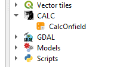
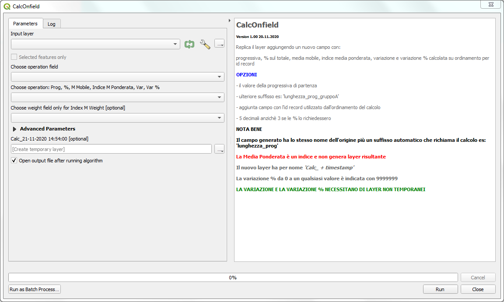
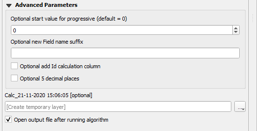

# CalcOnField
## Qgis Plugin per processing
Calcola la progressiva, la % sul totale, la media mobile,, la media ponderata, la variazione e la variazione % su un set di campi 

### Installazione

Per installarlo basta che scarichiate lo zip del repo e da QGis fate installa plugin da zip. Spero a breve sia disponibile nel repository ufficiale di QGis.

### Finestra processing

Il plugin, una volta caricato, compare negli script di processing nella cartella CALC

La finestra permette la scelta delle operazioni sul campo:

Il plugin permette crea una copia del layer aggiungendo un nuovo campo con il risultato di uno seguenti calcoli:

    progressiva,
    % sul totale,
    media mobile,
    indice media ponderata, [è un parametro]
    variazione,
    variazione % calcolata con ordinamento per id record

Il campo risultante ha lo stesso nome del campo di origine più un suffisso automatico che richiama il calcolo es: lunghezza ->> `lunghezza_prog`

Il nuovo layer temporaneo ha per nome `Calc_ + timestamp`

E' possibile ripetere l'operazione sui layer generati con la sola eccezione del calcolo della variazione e della variazione%

### PARAMETRI AVANZATI

    Opzionalmente è possibile inserire:
    - il valore della progressiva di partenza;
	- ulteriore postfisso es: `lunghezza_prog` + `_gruppo` = `lunghezza_prog_gruppo`;
    - campo con l'id record utilizzato dall'ordinamento del calcolo;
    - 5 decimali anzichè 3 se le % lo richiedessero".

### Avvertenze

La variazione e la variazione % necessitano di layer NON TEMPORANEI

La variazione % da 0 a un qualsiasi valore è indicata con 9999999

### Ringraziamenti
[QGIS.org](https://www.qgis.org/it/site/) - [Totò Fiandaca](https://pigrecoinfinito.com/) 

